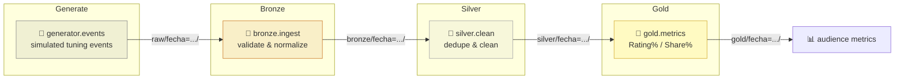

# 📺 TV Audience Metrics Pipeline

[](../../actions/workflows/pipeline.yml)
[](pyproject.toml)
[](https://duckdb.org)
[](infra/bootstrap.sh)
[](DOCUMENTATION.md)

A small, deterministic data pipeline that simulates TV tuning events and turns
them into daily **Rating%** and **Share%** metrics, using a Medallion
architecture (**Bronze → Silver → Gold**) on top of **DuckDB** and **AWS S3**,
orchestrated entirely by **GitHub Actions**.

> Built as a proof of concept for simple, idempotent, reproducible data
> engineering — no warehouse, no cluster, no long-lived AWS credentials.

---

## How it flows



Each stage reads only from the previous one, writes to its own S3 prefix, and
is safe to re-run: same input → byte-identical output (see
[determinism & idempotency](DOCUMENTATION.md#5-determinismo-e-idempotencia)).

---

## Quickstart

Requirements: **Python 3.12**.

```bash
pip install -e ".[dev]"
```

Run the unit tests — no AWS involved, everything runs against local temp files:

```bash
pytest tests/unit -v
```

Running plain `pytest` also collects `tests/integration/`, but those
auto-skip locally unless `BUCKET_NAME` and `AWS_REGION` are set — see
[`tests/integration/README.md`](tests/integration/README.md).

Try the reproducible event generator on its own:

```bash
python -m src.generator.events --seed 42 --date 2026-08-01 --out /tmp/eventos
```

---

## Running the pipeline for real

The pipeline only ever runs in **GitHub Actions** against a real S3 bucket,
authenticated via OIDC — never with local long-lived AWS keys (constitution
Principle VII). One-time setup:

1. Run [`infra/bootstrap.sh`](infra/bootstrap.sh) once against your AWS account
   (see the script header for required environment variables) to create the
   OIDC provider, IAM role, and S3 bucket.
2. Configure the repo's `ROLE_ARN` secret and `BUCKET_NAME` / `AWS_REGION`
   variables in GitHub with the values `bootstrap.sh` prints.
3. Trigger [`.github/workflows/pipeline.yml`](.github/workflows/pipeline.yml)
   via `workflow_dispatch`, or let the daily `schedule` trigger run it.

Full walkthrough: [`specs/001-audience-metrics-poc/quickstart.md`](specs/001-audience-metrics-poc/quickstart.md).

---

## Learn more

| Resource | What's in it |
|---|---|
| [`DOCUMENTATION.md`](DOCUMENTATION.md) | Consolidated technical reference — architecture, data model, module reference, security, CI/CD |
| [`specs/001-audience-metrics-poc/`](specs/001-audience-metrics-poc/) | Full spec, plan, and design docs |
| [`specs/001-audience-metrics-poc/quickstart.md`](specs/001-audience-metrics-poc/quickstart.md) | End-to-end validation guide (local + real AWS) |
| [`tests/integration/README.md`](tests/integration/README.md) | How integration tests exercise real S3 |
