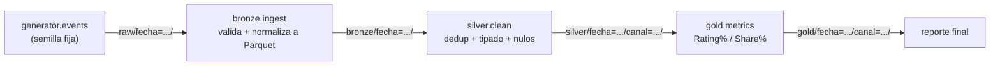

# Análisis y Diseño — TV Audience Metrics Pipeline

Documento de análisis y diseño del proyecto: qué problema resuelve, qué se decidió
construir y por qué. Es la puerta de entrada narrativa; el detalle técnico exhaustivo
vive en [`DOCUMENTATION.md`](../DOCUMENTATION.md) y en
[`specs/001-audience-metrics-poc/`](../specs/001-audience-metrics-poc/).

## Índice

1. [Contexto y problema](#1-contexto-y-problema)
2. [Objetivo de la POC](#2-objetivo-de-la-poc)
3. [Análisis de requisitos](#3-análisis-de-requisitos)
4. [Historias de usuario](#4-historias-de-usuario)
5. [Casos límite considerados](#5-casos-límite-considerados)
6. [Diseño de la solución](#6-diseño-de-la-solución)
7. [Modelo de datos](#7-modelo-de-datos)
8. [Decisiones de diseño clave](#8-decisiones-de-diseño-clave)
9. [Seguridad — estado real vs. diseño original](#9-seguridad--estado-real-vs-diseño-original)
10. [Criterios de éxito](#10-criterios-de-éxito)
11. [Fuera de alcance](#11-fuera-de-alcance)

---

## 1. Contexto y problema

Un canal de TV necesita medir su audiencia: cuánta gente sintoniza cada canal, y qué
porción del total de audiencia representa (Rating% y Share%), por franja horaria. En un
entorno real esto viene de un panel de medición (hogares instrumentados). Para esta POC
no se dispone de datos reales de panel, así que el primer requisito es **simular**
eventos de sintonía de forma reproducible, y a partir de ahí construir el pipeline que
los convierte en métricas.

## 2. Objetivo de la POC

Demostrar un pipeline de datos mínimo pero productivo que:

- Calcule **Rating%** y **Share%** por canal y franja horaria a partir de eventos de
  sintonía simulados.
- Sea **determinista** e **idempotente**: la misma entrada siempre produce la misma
  salida, y re-ejecutar no duplica ni corrompe resultados.
- Corra de punta a punta en un **entorno de automatización en la nube** (GitHub
  Actions) contra almacenamiento real (S3), sin intervención manual de credenciales en
  cada corrida.

No es objetivo: procesar datos reales de panel, servir un dashboard, ni operar a escala
de producción (ver [§11](#11-fuera-de-alcance)).

## 3. Análisis de requisitos

Requisitos funcionales (detalle completo con trazabilidad en
[`spec.md`](../specs/001-audience-metrics-poc/spec.md)):

| # | Requisito |
|---|---|
| FR-001 | Generar eventos de sintonía simulados de forma reproducible (semilla fija) |
| FR-002 | Ingerir eventos crudos a una capa bronze, sin lógica de negocio, particionada por fecha |
| FR-003 | Transformar bronze → silver: deduplicar por clave natural, tipar, manejar nulos |
| FR-004 | Rechazar en bronze los eventos que no cumplen el esquema |
| FR-005 | Calcular Rating% = audiencia del canal / universo total, por franja horaria |
| FR-006 | Calcular Share% = audiencia del canal / audiencia total sintonizando, por franja horaria |
| FR-007 | Emitir el resultado como reporte final (capa gold), una fila por fecha+canal+franja |
| FR-008 | Permitir re-ejecutar el pipeline (completo o parcial) sin duplicar resultados |
| FR-009 | Reemplazar la partición completa al escribir, nunca anexar |
| FR-010 | Prohibir no-determinismo (random sin semilla, wall-clock) dentro de la lógica de negocio |
| FR-011 | Correr de punta a punta desde automatización en la nube, sin claves de acceso de larga duración provistas manualmente en cada corrida |
| FR-012 | Permitir reanudar desde una etapa intermedia (bronze/silver/gold) |
| FR-013 | No exponer credenciales/secretos en logs |
| FR-014 | Representar explícitamente combinaciones canal+franja sin audiencia (0, no ausencia) |
| FR-015 | Regla determinista y documentada para resolver conflictos en la misma clave natural |

## 4. Historias de usuario

| Prioridad | Historia | Por qué |
|---|---|---|
| P1 | Como analista de audiencia, quiero obtener Rating%/Share% por canal y franja horaria | Es el entregable de negocio — sin esto el resto del pipeline no demuestra valor |
| P2 | Como operador, quiero re-ejecutar el pipeline sobre el mismo rango sin duplicar ni alterar resultados | Sin esta garantía, cualquier reintento o backfill es riesgoso |
| P3 | Como operador, quiero disparar la ejecución completa desde la nube contra S3 real, sin credenciales de larga duración | Valida que la POC es operable de forma repetible y auditable, no solo un script local |

Detalle de escenarios de aceptación:
[`spec.md`](../specs/001-audience-metrics-poc/spec.md#user-scenarios--testing-mandatory).

## 5. Casos límite considerados

- **Misma clave natural, valores distintos** (p. ej. `universo_total` difiere entre dos
  eventos del mismo hogar/canal/minuto) → se resuelve de forma determinista, sin
  duplicar el hogar en el conteo (ver [§8](#8-decisiones-de-diseño-clave)).
- **Franja horaria sin ninguna sintonización** → Share% queda `NULL` (indefinido, no
  `0`, para no mentir con un valor engañoso `0/0`).
- **Evento con campo requerido nulo o mal tipado** → se rechaza en bronze, sin detener
  el resto del lote.
- **Reprocesar una fecha sin eventos generados** → el pipeline completa sin error,
  produciendo capas vacías para esa fecha.

## 6. Diseño de la solución

Arquitectura **Medallion** (bronze → silver → gold), procesamiento 100% en **DuckDB**
sobre archivos descargados a disco efímero, almacenamiento en **S3**, orquestación en
**GitHub Actions**:

Cada etapa es un job independiente de GitHub Actions: no hay estado compartido entre
jobs más que lo que cada uno lee/escribe en S3. Este diseño permite el requisito P3
(reanudar desde una etapa intermedia) casi gratis — basta con que un job sepa leer la
partición que dejó el anterior.

Arquitectura completa, patrón de ejecución por job, y diagrama ASCII detallado:
[`DOCUMENTATION.md §2`](../DOCUMENTATION.md#2-arquitectura).

## 7. Modelo de datos

| Capa | Grano | Contenido |
|---|---|---|
| `raw/fecha=.../` | evento crudo | Salida directa del generador, sin validar (mecanismo de traspaso entre jobs, no una capa medallion) |
| `bronze/fecha=.../` | evento validado | Mismo grano que raw, pero tipado y validado contra `src/schema.py`, en Parquet |
| `silver/fecha=.../canal=.../` | evento único | Deduplicado por `(id_hogar_panelista, canal, timestamp)` |
| `gold/fecha=.../canal=.../` | fila por franja horaria | `rating_pct`, `share_pct`, `audiencia_canal`, `audiencia_total_franja`, `universo_total` |

Esquemas de columnas completos, tipos, y la fórmula exacta de cada métrica:
[`DOCUMENTATION.md §3`](../DOCUMENTATION.md#3-modelo-de-datos) y
[`data-model.md`](../specs/001-audience-metrics-poc/data-model.md).

**Invariante de negocio verificable**: para cualquier franja horaria con audiencia, la
suma de `share_pct` de todos los canales debe dar 100% (SC-004). Se verifica con la
query preset `share_check` de `scripts/query_gold.py` (ver
[manual de usuario](manual-usuario.md)) y con tests automatizados.

## 8. Decisiones de diseño clave

Resumen — justificación completa en
[`research.md`](../specs/001-audience-metrics-poc/research.md):

- **DuckDB nunca lee/escribe `s3://` directamente** (sin `httpfs`); toda la I/O de S3
  pasa por `boto3` puro en `src/s3_io.py`, con un patrón *download → procesar local →
  upload delete-then-write*. Evita mezclar dos mecanismos de credenciales y hace el
  reemplazo de partición atómico desde el punto de vista del pipeline.
- **Conflictos de `universo_total` en la misma clave natural** se resuelven tomando el
  `MAX(universo_total)` agrupado por clave — determinista, no depende del orden de
  lectura de los archivos de entrada.
- **Franja horaria = bloques de 60 minutos** truncando el timestamp a la hora, estándar
  de medición de audiencia de TV.
- **Sin Pydantic**: validación de esquema con un `dataclass` + funciones explícitas en
  `src/schema.py`, para no ocultar el mecanismo de validación detrás de una librería.
- **Sin Terraform/CDK**: el aprovisionamiento (`infra/bootstrap.sh`) es un script de AWS
  CLI, suficiente para los ~4 recursos de la POC.
- **Verificación de idempotencia por hash de contenido lógico** (vía DuckDB, excluyendo
  la columna de auditoría `procesado_en`), nunca por bytes de Parquet ni ETag de S3 —
  dos escrituras lógicamente idénticas pueden diferir en metadata binaria.

## 9. Seguridad — estado real vs. diseño original

El diseño original (y `DOCUMENTATION.md §6`, y `infra/bootstrap.sh`) contempla
autenticación **sin credenciales de larga duración**, vía OIDC
(`aws-actions/configure-aws-credentials` asumiendo un IAM Role federado). El script de
bootstrap todavía aprovisiona ese Role y su trust policy.

**Sin embargo, el workflow actual (`pipeline.yml`) no usa ese mecanismo**: desde el
commit `0a786d5` (*"fix: use static AWS access keys instead of OIDC role assumption"*),
cada job se autentica con `aws-access-key-id`/`aws-secret-access-key` estáticas,
guardadas como `secrets.AWS_ACCESS_KEY_ID` / `secrets.AWS_SECRET_ACCESS_KEY`. El nombre
del bucket también pasó de `vars.BUCKET_NAME` a `secrets.BUCKET_NAME` (commit
`2488705`).

Esto es una **desviación conocida del diseño original**, no documentada como decisión
formal — probablemente un ajuste práctico durante la implementación. Queda como deuda
técnica: el Role OIDC provisionado por `bootstrap.sh` no se usa, y el proyecto volvió a
depender de un secreto de larga duración rotable manualmente. Si se retoma el POC, vale
la pena decidir explícitamente si se revierte a OIDC o si se documenta esta elección
como definitiva.

El resto de las medidas de seguridad (bucket privado, cifrado en reposo/tránsito,
mínimo privilegio en la política IAM, sin secretos en logs) siguen vigentes tal como se
describen en [`DOCUMENTATION.md §6`](../DOCUMENTATION.md#6-seguridad).

## 10. Criterios de éxito

| Criterio | Medible como |
|---|---|
| SC-001 | Pipeline completo (día completo de eventos) corre en < 10 min |
| SC-002 | Dos corridas sobre el mismo rango → contenido lógico 100% idéntico en cada capa |
| SC-003 | 100% de eventos con esquema inválido rechazados antes de silver |
| SC-004 | Suma de Share% por franja = 100% (con audiencia) |
| SC-005 | Alguien sin conocimiento previo puede disparar una corrida y encontrar el reporte, solo con la documentación |
| SC-006 | Ninguna corrida expone un secreto en texto plano en sus logs |

## 11. Fuera de alcance

- Datos reales de panel (solo generador simulado).
- Capa de visualización/dashboard — el reporte gold se consume como archivo Parquet.
- Autenticación/control de acceso por usuario final más allá de los permisos de
  infraestructura ya definidos.
- Rendimiento a escala de producción real (la POC valida el mecanismo end-to-end, no
  throughput).
